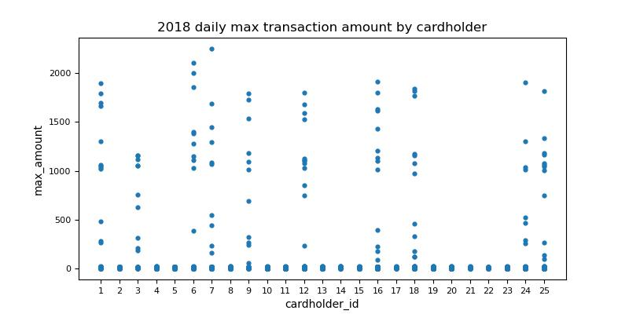

# Fraud Detection

### Context
The Data Analytics team has reviewed 25 credit card holders historical transactions and consumptions pattern in order to indentify possible fraudulent transactions. Specifically, the review seeks to answer the following questions:
*  Is there evidence to suggest that a credit card has been hacked?
*  Is there a particular time period in which potentially fraudulent transactions are made?
*  Has there been any fraudulent transaction made?
*  What are the top 5 merchants prone to being hacked using small transactions?

CFO has also requested a more detailed analysis on specific card holders. This README presents the observations and conclusion of the review and analysis. 

### Data and Model
To study the consumption pattern, we have relied on daily credit card transaction data for the period from 01 Jan 2018 to 31 December 2018. A database model was defined to store the credit card transaction data and a PostgreSQL database was created based on the model. The entity relationship diagram below sets out the defined database model.

Once the database schema is created, data was imported from the corresponding csv files. 

### Results and Obesrvations
#### Part 1. Potential Fraudelent Transactions
#### Is there a credit card has been hacks?
Some fraudsters hack a credit card by making several small transactions (generally less than $2.00), which are typically ignored by most cardholders. The chart below shows the total number of transactions that are less than $2.00 per cardholder.  

It is unreasonable to expect no small transactions. Small transactions could be genuine. To narrow down the list of potential fraudulent transactions, we analyse the consumption pattern by analysing the daily maximum transaction amount by cardholders. 

Cardholders with small transactions (less than $2.00) and also large transactions (greater than $500) are likely to have their credit card being hacked. From the total 25 cardholders reviewed, we have identified 10 cardholders may have their credit cards hacked and warrant further investigation. They are cardholder 1, 3, 6, 7, 9, 12, 16, 18, 24 and 25.

#### Is there a particular time period in which potentially fraudulent transactions are made?

#### Top 5 merchants prone to being hacked using small transactions

#### Part 2. Specific Card Holders
**Card holder 2**

**Card holder 18**

**Card holder 25**
The box plot below shows the expenditure data from January 2018 to June 2018 for cardholder ID 25.

We have identified 8 outliers in the expenditure data (on average at least one outlier transaction per month). The table below lists the outliers.  

| Index | Month | Merchant | Category | Amount |
|-------|-------|----------|----------|--------|
|1 | January| Cline, Myers and Strong| Restaurant| $1,177.00|
|2 | March | Griffin-Woodard| Bar| $1,334.00|
|3 | April | Bryant, Thomas and Collins| Pub| $1,063.00|
|4 | May | Hamilton-Mcfarland| Restaurant| $269.00|
|5 | June | Johnson-Fuller| Pub | $1,162.00|
|6 | June | Hamilton-Mcfarland| Restaurant| $749.00|
|7 | June | Cox, Montgomery and Morgan | Bar | $1,813.00|

