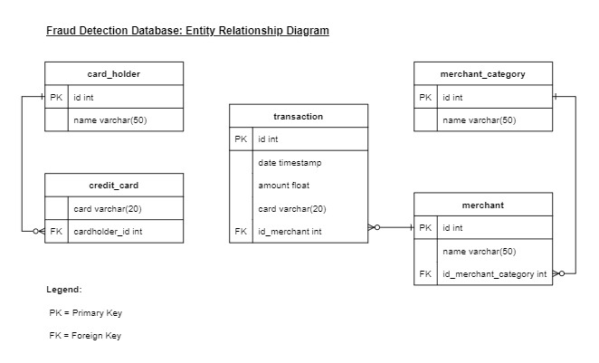

# Fraud Detection

### Context
The Data Analytics team has reviewed 25 credit card holders historical transactions and consumption pattern in order to identify possible fraudulent transactions. Specifically, the review seeks to answer the following questions:
*  Is there evidence to suggest that a credit card has been hacked?
*  Is there a particular time period in which potentially fraudulent transactions are made?
*  Has there been any fraudulent transaction made?
*  What are the top 5 merchants prone to being hacked using small transactions?

The CFO has also requested a more detailed analysis on specific card holders namely cardholder ID 2, 18 and 25.  

This README presents the observations and conclusion of the review and analysis. 

### Data and Model
To study the consumption pattern, we have relied on daily credit card transaction data for the period from 01 January 2018 to 31 December 2018. A database model was defined to store the credit card transaction data and a PostgreSQL database was created based on the model. The entity relationship diagram below sets out the defined database model.

Once the database schema is created, data was imported from the corresponding csv files. 

### Observations and Conclusion
#### Part 1. Potential Fraudelent Transactions
#### Is there a credit card has been hacked?
Some fraudsters hack a credit card by making several small transactions (generally less than $2.00), which are typically ignored by most cardholders. The bar chart below shows the total number of transactions that are less than $2.00 per cardholder.  

 Small transactions could be genuine. It is unreasonable to expect no small transactions. To increase the accuracy of our detection, we analyse the daily maximum transaction amount of each cardholders in order to establish an expected consumption pattern.

Cardholders with small transactions (less than $2.00) and also large transactions (greater than $500) are likely to have their credit card hacked. From the total 25 cardholders reviewed, we have identified 10 cardholders may have their credit cards hacked and warrant further investigation. They are cardholder 1, 3, 6, 7, 9, 12, 16, 18, 24 and 25.

#### Is there a particular time period in which potentially fraudulent transactions are made?
We observed 279 transaction made between 7am and 9am, of which 30 were small transactions (less than $2), 9 transactions were $100 or greater and the rest were less than $20. Appendix 1 lists out the top 100 highest transactions made between 7am and 9am.

The 9 transactions of amount $100 or greater were made by cardholders whom we suspected have their credit card hacked. These transactions could be fraudulent.

**Rest of the day**  
The number of fraudulent transactions observed between 7am to 9am is high but is not the highest. We have observed higher number of fraudulent transactions were made between 1am and 3am, and 1pm to 3pm. Hackers might have perceived that 1am-3am and 1pm-3pm window were when our fraud detection system most vulnerable due to mandatory security updates or batch processing.

#### Top 5 merchants prone to being hacked using small transactions
The top 5 merchants who are prone to being hacked using small transactions and their corresponding category are:  
| Merchant | Merchant Category |
|----------|-------------------|
|Wood-Ramirez| Pub |
|Hood-Phillips| Bar|
|Baker Inc| Food truck|
|Jarvis-Turner| Pub|
|Hamilton-Mcfarland| Restaurant|

#### Part 2. Specific Card Holders
**Cardholder ID 2 and 18**  
The line plots below represent the time series of transactions over 2018 for cardholder IDs 2 and 18.

Cardholder 2 consumption pattern looks fairly consistent throughout the year with all transactions always less than $20. There is no reason to suspect any fraudulent transaction in cardholder 2's history.   
Cardholder 18 consumption pattern seems to spike up every one or two months. The transaction amount observed in the spikes are at least 10 times higher than median transaction size. These spikes are likely to be fraudulent transaction and warrant further investigation. 

**Cardholder ID 25** 
The box plot below shows the expenditure data from January 2018 to June 2018 for cardholder ID 25.

We have identified 8 outliers in the expenditure data (on average at least one outlier transaction per month). The table below lists the outliers.  

| Index | Month | Merchant | Category | Amount |
|-------|-------|----------|----------|--------|
|1 | January| Cline, Myers and Strong| Restaurant| $1,177.00|
|2 | March | Griffin-Woodard| Bar| $1,334.00|
|3 | April | Bryant, Thomas and Collins| Pub| $1,063.00|
|4 | April | Hamilton-Mcfarland| Restaurant| $269.00|
|5 | May  | Baker Inc| Food truck | $1,046.00|
|6 | June | Johnson-Fuller| Pub | $1,162.00|
|7 | June | Hamilton-Mcfarland| Restaurant| $749.00|
|8 | June | Cox, Montgomery and Morgan | Bar | $1,813.00|

Most of the outlier transactions were more than $1,000. Half of these outliers were made between 6am and 7.30am.

### Appendix 1
* [Top 100 highest transactions made between 7am and 9am](./Extra/Output_top100_txn_7to9am.csv)